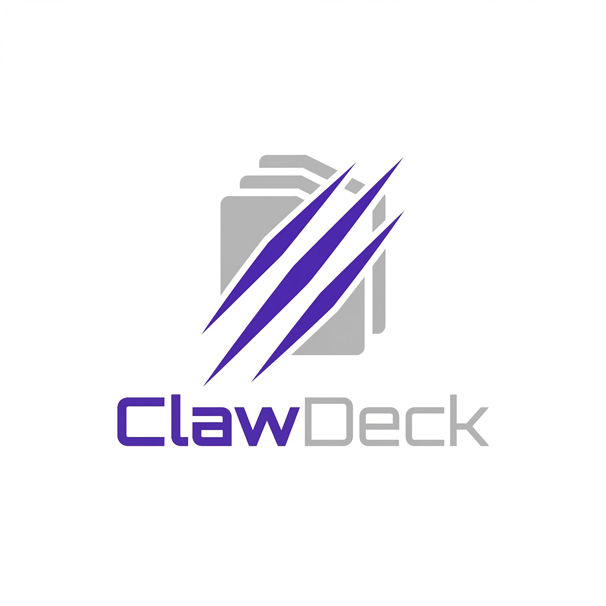

# ClawDeck

**ClawDeck** is an open-source web dashboard for managing [OpenClaw](https://openclaw.ai) multi-agent setups. Control your agents, monitor logs, browse workspaces, and explore agent memory — all from a clean, responsive UI.



---

## Features

- 🤖 **Agent Overview** — See all your OpenClaw agents and their status at a glance
- 💬 **Multi-Agent Chat** — Chat with multiple agents simultaneously in tabs, with real-time SSE streaming
- 📎 **File & Image Upload** — Send images and documents directly to agents
- 📋 **Log Viewer** — Real-time Gateway and per-Agent log streaming with color-coded levels
- 📁 **Workspace Browser** — Browse, view, and edit agent workspace files with Markdown rendering
- 🧠 **Memory Browser** — Search, view, and delete agent memories (LanceDB)
- 🔐 **Secure by Default** — JWT auth, API key auto-redaction, file blacklist protection
- 🌓 **Dark / Light Mode** — Follows system preference, manually toggleable
- 📱 **Mobile Responsive** — Works on phones and tablets
- ⚙️ **Setup Wizard** — Visual config checker that guides you through any missing settings
- 🐳 **One-command Install** — Interactive `install.sh` auto-detects your OpenClaw setup

---

## Prerequisites

### 1. OpenClaw with HTTP endpoints enabled

Add to your `~/.openclaw/openclaw.json`:

```json5
{
  "gateway": {
    "http": {
      "endpoints": {
        "chatCompletions": { "enabled": true },
        "responses": { "enabled": true }
      }
    }
  }
}
```

Then restart OpenClaw gateway:
```bash
systemctl --user restart openclaw-gateway
```

### 2. Docker & Docker Compose

```bash
sudo apt install docker.io docker-compose-v2
sudo usermod -aG docker $USER
newgrp docker
```

---

## Installation

### Quick Install (Recommended)

ClawDeck ships with an interactive installer that auto-detects your OpenClaw setup — no manual config needed.

```bash
git clone https://github.com/tonylnng/clawdeck.git
cd clawdeck
bash install.sh
```

The installer will:

1. **Auto-detect** your `~/.openclaw/openclaw.json` → reads gateway port & token automatically
2. **Scan** `~/.openclaw/agents/` → discovers all your agents and workspace paths
3. **Ask** for admin username/password and Docker network mode
4. **Generate** `.env` and `docker-compose.yml` tailored to your setup
5. **Build & start** ClawDeck with `docker compose up -d --build`

Then open **http://localhost:3000** and sign in.

---

### Manual Installation

If you prefer to configure manually:

```bash
git clone https://github.com/tonylnng/clawdeck.git
cd clawdeck
cp .env.example .env
```

Edit `.env`:

```env
# Admin credentials
ADMIN_USERNAME=admin
ADMIN_PASSWORD=yourpassword           # dev fallback (plain)
ADMIN_PASSWORD_HASH=                  # recommended: bcrypt hash (see below)
JWT_SECRET=                           # generate: openssl rand -hex 32
JWT_EXPIRES_IN=24h

# OpenClaw Gateway
OPENCLAW_GATEWAY_URL=http://127.0.0.1:18789
OPENCLAW_GATEWAY_TOKEN=               # from ~/.openclaw/openclaw.json → gateway.token

# Agents (comma-separated)
CLAWDECK_AGENTS=main,my-second-agent

# Workspace paths — one env var per agent
# Naming: WORKSPACE_<AGENT_ID uppercased, hyphens → underscores>
WORKSPACE_MAIN=/home/youruser/.openclaw/workspace
WORKSPACE_MY_SECOND_AGENT=/home/youruser/.openclaw/workspace-my-second-agent

# Ports & URLs
BACKEND_PORT=3001
FRONTEND_PORT=3000
NODE_ENV=production
NEXT_PUBLIC_BACKEND_URL=http://localhost:3001
```

<details>
<summary>Generate a bcrypt password hash</summary>

```bash
cd clawdeck/backend
npm install           # if not already done
node -e "const b=require('bcryptjs'); b.hash('yourpassword',10).then(console.log)"
```

</details>

Then start:

```bash
docker compose up -d --build
```

Open **http://localhost:3000** and sign in.

---

## Setup & Status Page

After logging in, go to **⚙️ Setup** in the sidebar to verify your configuration:

- ✅ Gateway URL configured
- ✅ Gateway reachable
- ✅ Agents detected
- ✅ Workspace paths resolved

If anything is missing, the page shows exactly what to fix.

---

## Adding More Agents

To add a new agent after install, edit `.env`:

```env
CLAWDECK_AGENTS=main,my-new-agent
WORKSPACE_MY_NEW_AGENT=/home/youruser/.openclaw/workspace-my-new-agent
```

Add the workspace volume to `docker-compose.yml`:

```yaml
volumes:
  - /home/youruser/.openclaw/workspace-my-new-agent:/home/youruser/.openclaw/workspace-my-new-agent:rw
```

Then restart:

```bash
docker compose up -d --build
```

---

## Remote Access (Tailscale)

ClawDeck works great over [Tailscale](https://tailscale.com) for secure remote access from any device.

During `install.sh`, choose **option 1** (host.docker.internal) for macOS/Windows Docker Desktop, or **option 3** (host network) for Linux.

Then set your Tailscale IP as the public backend URL when prompted:

```
Public backend URL: http://100.x.x.x:3001
```

Or manually in `.env`:

```env
NEXT_PUBLIC_BACKEND_URL=http://100.x.x.x:3001
```

---

## Security

- All API keys auto-redacted in logs and responses (`sk-`, `tvly-`, `jina_`, `ntn_`, etc.)
- Sensitive files blocked from read/write (`auth-profiles.json`, `.env`, `openclaw.json`, `*.key`, `*.pem`)
- JWT HttpOnly cookies
- Keep ClawDeck on localhost or a private network (Tailscale recommended)

---

## Tech Stack

| Layer | Tech |
|-------|------|
| Frontend | Next.js 14 + TypeScript + Tailwind CSS + shadcn/ui |
| Backend | Express.js + TypeScript |
| Real-time | SSE (Server-Sent Events) |
| Deployment | Docker Compose |

---

## License

MIT
